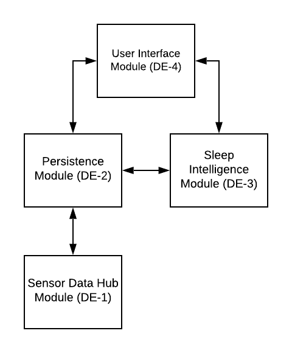

The Hypnos Sleep System uses a mix of architectural styles for each of the four modules. The Sensor Data Hub module uses pipe and filter, the Persistence Module uses the database architecture, the Sleep Intelligence Module uses implicit invocation, and the User Interface uses the model-view-controller style.

Testing will consist of three phases and will be conducted using the Black Box methodology so that the internal structure is not revealed. These phases will be Sensor Data Persistence (<abbr title="Sensor Data Hub Module">DE-1</abbr> & <abbr title="Persistence Module">DE-2</abbr>), User Interface Data View/Manipulation (<abbr title="Persistence Module">DE-2</abbr>, <abbr title="Sleep Intelligence Module">DE-3</abbr>, <abbr title="User Interface Module">DE-4</abbr>), Sleep Intelligence Analysis (<abbr title="Sleep Intelligence Module">DE-3</abbr>, <abbr title="Persistence Module">DE-2</abbr>). By conducting the integration tests in these three phases we can isolate the main communication channels of the system and validate them independently.

<figure>
  
  <figcaption>Figure 1. Relationship of Hpynos Sleep Modules</figcaption>
</figure>

